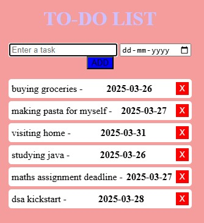

# Weather App

## 📌 Description
A simple task management app where users can add, delete with day/date/year mentioned of a task.

## 🛠️ Technologies Used
- HTML
- CSS (Optional for styling)
- jQuery for dynamic UI updates
- Bootstrap for styling
- Local Storage for saving tasks

## 🚀 Features
- Add/Delete Tasks
- Date/Day/year to do a particular task mentioned

## 📂 Project Structure
```
📂 WeatherApp/
 ├── 📜 index.html  (Main HTML file)
 ├── 📜 README.md  (Project documentation)
```
## 📸 Screenshot 


## 📩 Contact
reach out to me at [vidhi.23bce11014@vitbhopal.ac.in].